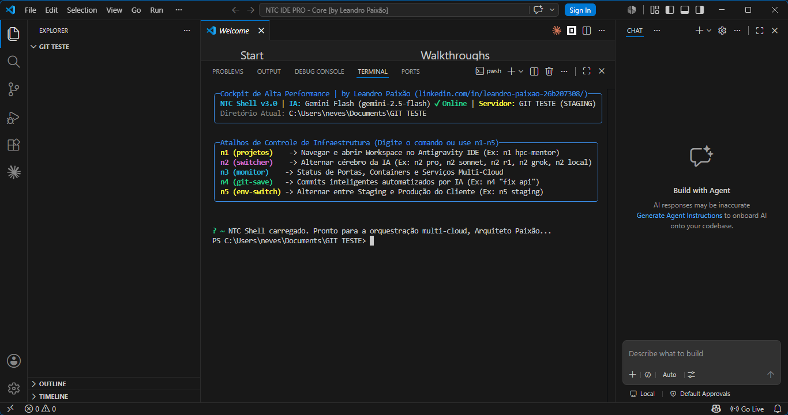

# 🪐 NTC IDE PRO: The Hyper-Isolated Developer Environment



An advanced, isolated, and custom-profile distribution of VS Code engineered to operate with zero global system dependencies. Optimized for high-tempo development, custom prompt engineering, and deep terminal synchronization.

Developed by **Leandro Paixão** (SaaS & Cloud Architect).

---

## 🌌 The Concept: Why Profile Isolation?

Standard VS Code installations share extensions, workspace caches, and settings globally across your computer. When you work with multiple clients or experiment with diverse LLM workflows, a global environment becomes bloated, slow, and prone to extension conflicts.

**NTC IDE PRO** solves this by leveraging a sandboxed runtime profile utilizing custom user data directories (`--user-data-dir`). It operates completely separate from your daily VS Code installation, bringing:
*   **Isolated Extensions:** Run only elite coding extensions without bloating your primary setup.
*   **Embedded Cockpit:** Launches natively with the **NTC Shell** (PowerShell 7 + Oh My Posh) running in the terminal dock.
*   **Clean Settings:** Strict aesthetics, custom developer typography, and clean window layouts optimized for deep work.

---

## ⚡ Execution Architecture (The Launcher)

Instead of relying on heavy application clones, **NTC IDE PRO** uses a high-performance shell bootstrap function. When you run `ntc-ide` (or use the shortcut `n1` on the NTC Shell), the terminal fires up a dedicated profile pointing to an isolated directory map:

```powershell
function global:ntc-ide {
    param([string]$folderPath = ".")
    $profileDir = "$HOME\Documents\ntc-ide-pro\IDE\profile-data"
    Start-Process "code" -ArgumentList "$folderPath --user-data-dir `"$profileDir`"" -NoNewWindow
}
```

---

## 🛠️ Installation & Setup

### 1. Requirements

- VS Code installed on your system.
- The **MesloLGS NF** Nerd Font installed for terminal icon support.

### 2. Deployment

To clone and register the isolated profile on your system, run:

```bash
# Clone the repository into your documents folder
cd "$HOME\Documents"
git clone https://github.com/paixaoinfo/ntc-ide-pro.git

# Execute the local configuration script to register 'ntc-ide' globally
cd ntc-ide-pro
./setup_ntc_ide_pro.ps1
```

### 3. Usage

Once registered, you can summon your isolated workspace from any directory:

```bash
ntc-ide .
```
